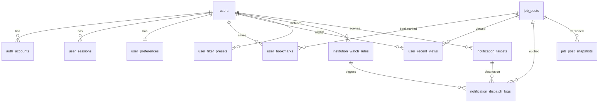

# 로그인 도입 포함 DB 설계안 (Public Job Portal)

## 1) 설계 목표

현재 프로젝트 기능(북마크, 최근 본 공고, 필터 프리셋, 캘린더, 지도/대시보드, 다국어/PWA)과
향후 요구(기관 watch + 일 단위 체크 + 메신저 알림)를 **로그인 사용자 기준으로 서버 영속화**하기 위한 DB 설계안이다.

- DBMS 기준: **PostgreSQL 15+**
- 시간 타입: `timestamptz`(UTC 저장)
- 기본 키: `uuid`
- 문자열 정규화: 이메일/기관명 검색용 `citext` 또는 소문자 컬럼 병행

### PostgreSQL 전용 기준(확정)

본 문서는 PostgreSQL 전용으로 설계한다.

- 확장: `pgcrypto`, `citext` 사용
- JSON 타입: `jsonb` 사용 (`json` 미사용)
- 열거형: Postgres `enum` 타입 사용 권장
  - `user_status`: `active`, `suspended`, `deleted`
  - `check_interval_type`: `daily`, `hourly`
  - `notification_channel`: `kakao`, `slack`, `telegram`, `email`
  - `dispatch_status`: `queued`, `sent`, `failed`, `skipped`
- 인덱스: `btree` 기본 + 필요 시 `gin(jsonb_path_ops)`
- 감사/정렬 컬럼: `created_at`, `updated_at`는 `timestamptz not null`

---

## 2) 기능-엔티티 매핑

1. 로그인/세션/소셜 로그인
   - `users`, `auth_accounts`, `user_sessions`
2. 사용자 개인화
   - `user_preferences` (theme/language/timezone)
   - `user_bookmarks`, `user_recent_views`, `user_filter_presets`
3. 알림(기관 watch + 일일 체크 + 메신저 발송)
   - `institution_watch_rules`, `notification_targets`, `notification_dispatch_logs`
4. 공고 스냅샷(중복 감지/알림 기준)
   - `job_posts`, `job_post_snapshots`

---

## 3) ERD (핵심)



---

## 4) 테이블 상세 설계

## 4.1 users

서비스의 사용자 기준 테이블.

| 컬럼 | 타입 | 제약 | 설명 |
|---|---|---|---|
| id | uuid | PK | 사용자 ID |
| email | citext | UNIQUE, NULL 가능 | 이메일 로그인 사용 시 |
| password_hash | text | NULL 가능 | 자체 로그인 시 bcrypt/argon2 해시 |
| display_name | varchar(80) |  | 표시명 |
| status | varchar(20) | default `active` | active/suspended/deleted |
| created_at | timestamptz | not null | 생성시각 |
| updated_at | timestamptz | not null | 수정시각 |
| deleted_at | timestamptz | null | 소프트 삭제 |

권장 인덱스: `(status)`, `(created_at desc)`

## 4.2 auth_accounts

소셜 로그인/외부 인증 연동(google, kakao 등).

| 컬럼 | 타입 | 제약 | 설명 |
|---|---|---|---|
| id | uuid | PK | 계정 레코드 ID |
| user_id | uuid | FK -> users(id) | 소유 사용자 |
| provider | varchar(30) | not null | google/kakao/github... |
| provider_account_id | varchar(191) | not null | provider의 고유 식별자 |
| access_token | text | null | 필요 시 암호화 저장 |
| refresh_token | text | null | 필요 시 암호화 저장 |
| expires_at | timestamptz | null | 토큰 만료 |
| created_at | timestamptz | not null | 생성시각 |

유니크: `(provider, provider_account_id)`

## 4.3 user_sessions

로그인 세션/JWT 리프레시 추적.

| 컬럼 | 타입 | 제약 | 설명 |
|---|---|---|---|
| id | uuid | PK | 세션 ID |
| user_id | uuid | FK -> users(id) | 사용자 |
| session_token_hash | text | not null, UNIQUE | 세션 토큰 해시 |
| user_agent | text | null | 디바이스 식별 보조 |
| ip_addr | inet | null | 보안 로그 |
| expires_at | timestamptz | not null | 만료시각 |
| created_at | timestamptz | not null | 생성시각 |

인덱스: `(user_id, expires_at desc)`

## 4.4 user_preferences

UI/사용성 개인 설정 저장.

| 컬럼 | 타입 | 제약 | 설명 |
|---|---|---|---|
| user_id | uuid | PK, FK -> users(id) | 사용자 |
| language | varchar(5) | default `ko` | ko/en |
| theme | varchar(10) | default `system` | light/dark/system |
| timezone | varchar(60) | default `Asia/Seoul` | 알림 스케줄 기준 |
| updated_at | timestamptz | not null | 수정시각 |

## 4.5 user_bookmarks

현재 localStorage 북마크의 서버 영속 버전.

| 컬럼 | 타입 | 제약 | 설명 |
|---|---|---|---|
| user_id | uuid | FK -> users(id) | 사용자 |
| job_post_id | uuid | FK -> job_posts(id) | 공고 |
| created_at | timestamptz | not null | 저장시각 |

PK: `(user_id, job_post_id)`

## 4.6 user_recent_views

최근 본 공고(현재 최대 10개 정책).

| 컬럼 | 타입 | 제약 | 설명 |
|---|---|---|---|
| id | uuid | PK | 레코드 ID |
| user_id | uuid | FK -> users(id) | 사용자 |
| job_post_id | uuid | FK -> job_posts(id) | 공고 |
| viewed_at | timestamptz | not null | 열람시각 |

인덱스: `(user_id, viewed_at desc)`

정책: 사용자별 10개 유지(트리거/배치 정리)

## 4.7 user_filter_presets

검색 필터 프리셋 저장.

| 컬럼 | 타입 | 제약 | 설명 |
|---|---|---|---|
| id | uuid | PK | 프리셋 ID |
| user_id | uuid | FK -> users(id) | 사용자 |
| name | varchar(80) | not null | 프리셋명 |
| filters_json | jsonb | not null | keyword/regions/hireTypes/... |
| created_at | timestamptz | not null | 생성시각 |
| updated_at | timestamptz | not null | 수정시각 |

유니크 권장: `(user_id, name)`

## 4.8 job_posts

외부 공공 API 공고의 정규화된 캐시 테이블.

| 컬럼 | 타입 | 제약 | 설명 |
|---|---|---|---|
| id | uuid | PK | 내부 ID |
| source | varchar(30) | not null | data_go_kr |
| source_job_sn | bigint | not null | recrutPblntSn |
| institution_name | varchar(200) | not null | 기관명 |
| title | text | not null | 공고명 |
| ncs_text | text | null | 직무분야 |
| hire_type_text | text | null | 고용형태 |
| work_region_text | text | null | 근무지역 |
| recruit_type_text | text | null | 채용구분 |
| recruit_count | integer | null | 채용인원 |
| start_ymd | char(8) | null | 공고시작일 |
| end_ymd | char(8) | null | 공고종료일 |
| ongoing_yn | char(1) | null | 진행 여부 |
| src_url | text | null | 원문 URL |
| raw_payload | jsonb | not null | 원본 payload |
| first_seen_at | timestamptz | not null | 최초 수집시각 |
| last_seen_at | timestamptz | not null | 최근 수집시각 |

유니크: `(source, source_job_sn)`

인덱스: `(institution_name)`, `(end_ymd)`, `(last_seen_at desc)`

## 4.9 job_post_snapshots

알림/변경 추적용 스냅샷.

| 컬럼 | 타입 | 제약 | 설명 |
|---|---|---|---|
| id | uuid | PK | 스냅샷 ID |
| job_post_id | uuid | FK -> job_posts(id) | 공고 |
| content_hash | char(64) | not null | 주요 필드 해시 |
| snapshot_json | jsonb | not null | 스냅샷 데이터 |
| captured_at | timestamptz | not null | 캡처시각 |

인덱스: `(job_post_id, captured_at desc)`

## 4.10 institution_watch_rules

"특정 기관 공고 알림" 설정.

| 컬럼 | 타입 | 제약 | 설명 |
|---|---|---|---|
| id | uuid | PK | 룰 ID |
| user_id | uuid | FK -> users(id) | 사용자 |
| institution_name | varchar(200) | not null | 감시 기관명 |
| check_interval | varchar(20) | default `daily` | daily/hourly |
| active | boolean | default true | 활성화 |
| last_checked_at | timestamptz | null | 마지막 체크 |
| created_at | timestamptz | not null | 생성시각 |

인덱스: `(user_id, active)`, `(institution_name, active)`

## 4.11 notification_targets

사용자 알림 수신 채널(메신저/이메일 등).

| 컬럼 | 타입 | 제약 | 설명 |
|---|---|---|---|
| id | uuid | PK | 타겟 ID |
| user_id | uuid | FK -> users(id) | 사용자 |
| channel | varchar(20) | not null | kakao/slack/telegram/email |
| destination | text | not null | 채널 사용자 식별자 |
| verified | boolean | default false | 검증 여부 |
| consented_at | timestamptz | null | 수신 동의 시각 |
| opted_out_at | timestamptz | null | 수신 거부 시각 |
| active | boolean | default true | 사용 가능 여부 |
| created_at | timestamptz | not null | 생성시각 |

인덱스: `(user_id, active)`, `(channel, active)`

## 4.12 notification_dispatch_logs

알림 발송 이력/중복 방지/재시도.

| 컬럼 | 타입 | 제약 | 설명 |
|---|---|---|---|
| id | uuid | PK | 로그 ID |
| user_id | uuid | FK -> users(id) | 수신 사용자 |
| watch_rule_id | uuid | FK -> institution_watch_rules(id) | 트리거 룰 |
| target_id | uuid | FK -> notification_targets(id) | 발송 채널 |
| job_post_id | uuid | FK -> job_posts(id) | 연관 공고 |
| status | varchar(20) | not null | queued/sent/failed/skipped |
| error_message | text | null | 실패 메시지 |
| attempted_at | timestamptz | not null | 시도시각 |
| sent_at | timestamptz | null | 성공시각 |
| idempotency_key | varchar(191) | not null | 중복방지키 |

유니크: `(idempotency_key)`

idempotency_key 예시:
`sha256(user_id + watch_rule_id + job_post_id + channel + yyyymmdd)`

---

## 5) PostgreSQL DDL 예시 (핵심)

```sql
create extension if not exists pgcrypto;
create extension if not exists citext;

do $$ begin
  create type user_status as enum ('active', 'suspended', 'deleted');
exception when duplicate_object then null;
end $$;

do $$ begin
  create type check_interval_type as enum ('daily', 'hourly');
exception when duplicate_object then null;
end $$;

do $$ begin
  create type notification_channel as enum ('kakao', 'slack', 'telegram', 'email');
exception when duplicate_object then null;
end $$;

do $$ begin
  create type dispatch_status as enum ('queued', 'sent', 'failed', 'skipped');
exception when duplicate_object then null;
end $$;

create table users (
  id uuid primary key default gen_random_uuid(),
  email citext unique,
  password_hash text,
  display_name varchar(80),
  status user_status not null default 'active',
  created_at timestamptz not null default now(),
  updated_at timestamptz not null default now(),
  deleted_at timestamptz
);

create table user_preferences (
  user_id uuid primary key references users(id) on delete cascade,
  language varchar(5) not null default 'ko',
  theme varchar(10) not null default 'system',
  timezone varchar(60) not null default 'Asia/Seoul',
  updated_at timestamptz not null default now()
);

create table job_posts (
  id uuid primary key default gen_random_uuid(),
  source varchar(30) not null,
  source_job_sn bigint not null,
  institution_name varchar(200) not null,
  title text not null,
  ncs_text text,
  hire_type_text text,
  work_region_text text,
  recruit_type_text text,
  recruit_count integer,
  start_ymd char(8),
  end_ymd char(8),
  ongoing_yn char(1),
  src_url text,
  raw_payload jsonb not null,
  first_seen_at timestamptz not null default now(),
  last_seen_at timestamptz not null default now(),
  unique (source, source_job_sn)
);

create table user_bookmarks (
  user_id uuid not null references users(id) on delete cascade,
  job_post_id uuid not null references job_posts(id) on delete cascade,
  created_at timestamptz not null default now(),
  primary key (user_id, job_post_id)
);

create table user_recent_views (
  id uuid primary key default gen_random_uuid(),
  user_id uuid not null references users(id) on delete cascade,
  job_post_id uuid not null references job_posts(id) on delete cascade,
  viewed_at timestamptz not null default now()
);

create index idx_recent_views_user_time on user_recent_views(user_id, viewed_at desc);

create table user_filter_presets (
  id uuid primary key default gen_random_uuid(),
  user_id uuid not null references users(id) on delete cascade,
  name varchar(80) not null,
  filters_json jsonb not null,
  created_at timestamptz not null default now(),
  updated_at timestamptz not null default now(),
  unique (user_id, name)
);

create table institution_watch_rules (
  id uuid primary key default gen_random_uuid(),
  user_id uuid not null references users(id) on delete cascade,
  institution_name varchar(200) not null,
  check_interval check_interval_type not null default 'daily',
  active boolean not null default true,
  last_checked_at timestamptz,
  created_at timestamptz not null default now()
);

create table notification_targets (
  id uuid primary key default gen_random_uuid(),
  user_id uuid not null references users(id) on delete cascade,
  channel notification_channel not null,
  destination text not null,
  verified boolean not null default false,
  consented_at timestamptz,
  opted_out_at timestamptz,
  active boolean not null default true,
  created_at timestamptz not null default now()
);

create table notification_dispatch_logs (
  id uuid primary key default gen_random_uuid(),
  user_id uuid not null references users(id) on delete cascade,
  watch_rule_id uuid references institution_watch_rules(id) on delete set null,
  target_id uuid references notification_targets(id) on delete set null,
  job_post_id uuid references job_posts(id) on delete set null,
  status dispatch_status not null,
  error_message text,
  attempted_at timestamptz not null default now(),
  sent_at timestamptz,
  idempotency_key varchar(191) not null unique
);
```

---

## 6) 기존 localStorage 기능 마이그레이션 정책

로그인 첫 성공 시 1회 마이그레이션 API로 업로드:

1. `bookmarkStore` -> `user_bookmarks`
2. `recentViewedStore` -> `user_recent_views` (최대 10개 유지)
3. `filterPresetStore` -> `user_filter_presets`
4. theme/language -> `user_preferences`

충돌 정책:
- 북마크: `(user_id, job_post_id)` 기준 upsert
- 프리셋: 같은 이름 존재 시 `name (1)`, `name (2)`로 저장 또는 덮어쓰기 옵션

---

## 7) 운영/보안 권장사항

1. 비밀번호는 argon2id 해시
2. 토큰/메신저 식별자 등 민감값은 애플리케이션 레벨 암호화
3. 알림 전송은 큐(worker) 분리, 실패 재시도(지수 백오프)
4. `notification_dispatch_logs` 보존 기간(예: 90일) 정책화
5. 개인정보 삭제 요청 시 user cascade + 비식별 로그 분리

---

## 8) MVP 필수 vs 확장

MVP 필수:
- `users`, `user_sessions`, `user_preferences`
- `job_posts`
- `user_bookmarks`, `user_recent_views`, `user_filter_presets`
- `institution_watch_rules`, `notification_targets`, `notification_dispatch_logs`

확장(2단계):
- `job_post_snapshots` (변경 diff 기반 정교한 알림)
- 채널별 템플릿 테이블, 발송 rate-limit 테이블
- 조직/팀 기능(기업 계정)
