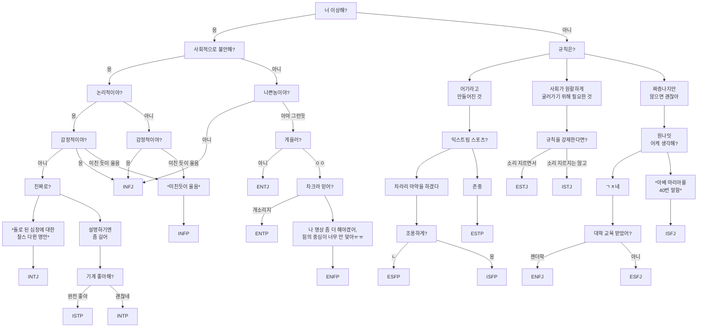

# MBTI 흐름도

이미지의 겹친 감정 질문 연결선은 앱에서 사용할 수 있게 해석했습니다.
`미친 듯이 울음`을 별도 선택지로 두었으며, 강제 여부의 연속 질문은 앱에서 하나로 합쳤습니다.

```mermaid
flowchart TD
    START["너 이상해?"]

    START -->|응| SOCIAL["사회적으로 불안해?"]
    START -->|아니| RULE["규칙은?"]

    SOCIAL -->|응| LOGIC["논리적이야?"]
    SOCIAL -->|아니| BAD["나쁜놈이야?"]

    LOGIC -->|응| EMOTION1["감정적이야?"]
    LOGIC -->|아니| EMOTION2["감정적이야?"]

    EMOTION1 -->|아니| REALLY["진짜로?"]
    EMOTION1 -->|응| INFJ["INFJ"]
    EMOTION1 -->|미친 듯이 울음| CRY["*미친듯이 울음*"]

    EMOTION2 -->|응| INFJ
    EMOTION2 -->|미친 듯이 울음| CRY
    CRY --> INFP["INFP"]

    REALLY --> QUOTE["*돌로 된 심장에 대한<br/>찰스 다윈 명언*"]
    QUOTE --> INTJ["INTJ"]

    REALLY --> LONG["설명하기엔<br/>좀 길어"]
    LONG --> MACHINE["기계 좋아해?"]
    MACHINE -->|완전 좋아| ISTP["ISTP"]
    MACHINE -->|괜찮네| INTP["INTP"]

    BAD -->|아니| INFJ
    BAD -->|아마 그런듯| LAZY["게을러?"]
    LAZY -->|아니| ENTJ["ENTJ"]
    LAZY -->|ㅇㅇ| CHAKRA["차크라 믿어?"]
    CHAKRA -->|개소리지| ENTP["ENTP"]
    CHAKRA --> MEDITATE["나 명상 좀 더 해야겠어,<br/>힘의 중심이 너무 안 맞아ㅠㅠ"]
    MEDITATE --> ENFP["ENFP"]

    RULE --> BREAK["어기라고<br/>만들어진 것"]
    RULE --> NEED["사회가 원활하게<br/>굴러가기 위해 필요한 것"]
    RULE --> ANNOYING["짜증나지만<br/>않으면 괜찮아"]

    BREAK --> EXTREME["익스트림 스포츠?"]
    EXTREME --> DRUG["차라리 마약을 하겠다"]
    EXTREME --> RESPECT["존중"]
    RESPECT --> ESTP["ESTP"]

    DRUG --> QUIET["조용하게?"]
    QUIET -->|ㄴ| ESFP["ESFP"]
    QUIET -->|응| ISFP["ISFP"]

    NEED --> FORCE["규칙을 강제한다면?"]
    FORCE -->|소리 지르면서| ESTJ["ESTJ"]
    FORCE -->|소리 지르지는 않고| ISTJ["ISTJ"]

    ANNOYING --> ONENIGHT["원나잇<br/>어케 생각해?"]
    ONENIGHT --> OKAY["ㄱㅊ네"]
    ONENIGHT --> MARIA["*아베 마리아를<br/>40번 말함*"]
    MARIA --> ISFJ["ISFJ"]

    OKAY --> COLLEGE["대학 교육 받았어?"]
    COLLEGE -->|젠더학| ENFJ["ENFJ"]
    COLLEGE -->|아니| ESFJ["ESFJ"]
```
